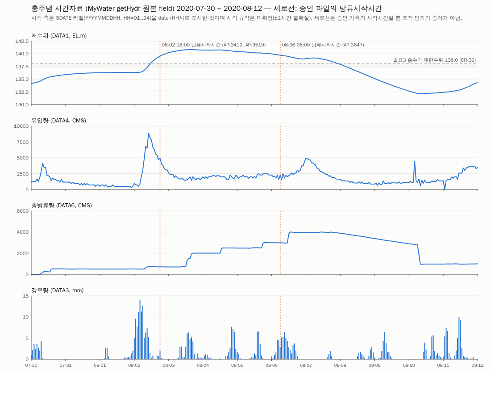

# L. 데이터 검토용 요약 (Data Review)

> **목적:** 지금까지 수집·정규화한 실제 자료가 어떤 모습인지 보여주는 것. Ontology 수정, KG 구축, 새 Relation 생성, 변수 의미 통합은 하지 않았다. 표의 값은 원자료/정규화 파일에서 그대로 가져왔고, 해석 문장은 넣지 않았다. 원본 컬럼명은 임의로 바꾸지 않았다(괄호 안 단위·라벨은 출처 페이지 표기).
> 이 문서는 `scripts/build_data_review.py`, `build_data_review_md.py`가 데이터에서 자동 생성했다. 표본 CSV와 그래프는 `04_reports/data_review/`에 있다.

## 1. 현재 확보한 데이터 전체 구성

| 데이터 | 출처 | 파일 | 레코드 수 | 주요 컬럼 | 기간 | 관련 Ontology 개념 |
|---|---|---|---|---|---|---|
| Dam | K-water MyWater getBasic/damList; KHNP 페이지(이름만); 별표1 | 03_normalized/dam_catalog.csv | 18 | dam_id_source, dam_name_source, operator_evidence, organization, river_label_in_source, 별표1 한강수계 여부 | 제원은 스냅샷(현재) | Dam |
| Dam(제원 상세) | MyWater getBasic | 03_normalized/dam_catalog_kwater_basic.csv | 11 | 높이·길이·유역면적·계획홍수위·상시만수위·홍수기제한수위·총저수용량 등 [DATAn] | 스냅샷 | Dam (속성) |
| ObservationStation | MyWater getRain(우량A/수위C) | 03_normalized/observation_station_list.csv | 94 | station_id_OBS_CD, station_name_source, station_type, associated_DAM_CD | 지점 목록(시점 스냅샷) | ObservationStation |
| MeasurementDataset(목록) | MyWater getPeriod/getHydr/getRain | 03_normalized/measurement_dataset_list.csv | 71 | dataset_id(임시), resolution, variable(s), facility, start/end, n_raw_files | 2019-08-01~2026-09-28 중 요청 구간 | MeasurementDataset |
| Measurement(시간 long) | MyWater getPeriod | 03_normalized/kwater_mywater_period_hourly_long.csv.gz | 1784596 | DAM_CD, SDATE_raw, source_variable_name, value_raw, key_present_in_raw | 2021-01-01~2026-09-28 | MeasurementDataset 내용 |
| Measurement(일 long) | MyWater getPeriod | 03_normalized/kwater_mywater_period_daily_long.csv.gz | 125820 | 동일 | 2021-01-01~2026-09-28 | 〃 |
| Measurement(10분 long, 홍수기) | MyWater getPeriod | 03_normalized/kwater_mywater_period_10min_long.csv.gz | 1762560 | 동일 | 2021~2025 각 6/21~9/30 | 〃 |
| Measurement(댐별 hydr 시간) | MyWater getHydr | 03_normalized/kwater_mywater_hydr_H_wide.csv.gz | 553609 | DAM_CD, SDATE_raw, DATA1~DATA7(수위·저수량·강우량·유입량·?·총방류량·저수율) | 2021-01-01~2026-09-28 (11개 시설) | 〃 |
| Criterion | 법제처 DRF (연계운영규정 별표3·조문) | 03_normalized/criterion_list.csv | 15 | criterion_id(임시), locator, verbatim_text_or_value, unit, applies_to_facility, defined_in_document | 시행 2026-07-08 기준 현행 | Criterion |
| Document | 법제처 DRF/첨부, K-water·KHNP·포털 스냅샷 | 03_normalized/document_list.csv | 45 | document_id(임시), title, organization, type, source_url, raw_file, sha256 | 2026-09-29 수집 | Document |
| Approval | 한강홍수통제소(공공데이터포털 15085926 CSV) | 03_normalized/approval_records_hrfco_raw_fields.csv | 3929 | 순차번호, 관측소코드, 관측소명, 승인년월일시분, 방류시작시간, 접수방류량, 접수일자, 비고 | 승인 2010-07-16~2021-07-16 | Approval |
| 상·하류 관계 evidence | K-water 한강유역본부 시설 소개 텍스트 | 03_normalized/dam_network_evidence.csv | 11 | upstream_dam, downstream_dam, relation_type, verbatim_quote, verification_status | 현재 서술 | (현재 Ontology에 대응 Relation 없음) |
| 수계 소속(membership) | 연계운영규정 별표1 | 03_normalized/han_system_membership_byeolpyo1.csv | 4 | basin_label, facility_category, facilities_verbatim | 현행 | Dam 속성(수계 소속) |
| Approval–Measurement 연결 사례 | 위 자료의 조합 | 03_normalized/linkage_pilot_cases.csv | 24 | case_id, 승인 원문 필드, linked_criterion_id, n_hourly_measurement_rows | 2019-08~10, 2020-07-25~09-10 | (연결 가능성 확인용) |

> "관련 Ontology 개념"은 현재 Ontology(Class 7개) 중 어느 것과 관련되는지만 표시한 것이며 매핑을 확정한 것이 아니다. `Operation`은 실제 instance를 확보하지 못했다(현재 수집 환경 기준).
> 측정자료 원본 JSON은 `01_raw/KWater/…`(압축본 `01_raw_archive/`), 승인 원본은 `01_raw/FloodControl/`, 법령 원본은 `01_raw/Law/`, `01_raw/Regulations/`.

## 2. 실제 데이터 샘플

### 2-1. Dam (`03_normalized/dam_catalog.csv` 앞 8행, 제원은 `dam_catalog_kwater_basic.csv`에서 결합)
| dam_id_source | dam_name_source | organization | river_label(source) | 총저수용량(MCM)[DATA13] | 유역면적(km2)[DATA5] | 홍수기제한수위(EL.m)[DATA10] | 계획홍수위(EL.m)[DATA8] |
|---|---|---|---|---|---|---|---|
| 1001210 | 광동댐 | 한국수자원공사 | 한강 | 13.13 | 125 | 672 | 675.3 |
| 1003110 | 충주댐 | 한국수자원공사 | 한강 | 2750 | 6648 | 138 | 145 |
| 1003611 | 충주조정지 | 한국수자원공사 | 한강 | 30 | 97 | 0 | 67.3 |
| 1006110 | 횡성댐 | 한국수자원공사 | 한강 | 86.9 | 209 | 178.2 | 180 |
| 1007601 | 강천보 | 한국수자원공사 | 한강 |  |  |  |  |
| 1007602 | 여주보 | 한국수자원공사 | 한강 |  |  |  |  |
| 1007603 | 이포보 | 한국수자원공사 | 한강 |  |  |  |  |
| 1009710 | 평화의댐 | 한국수자원공사 |  | 2630 | 3208 | 0 | 264.6 |
→ 전체 샘플: `04_reports/data_review/sample_dam.csv`. `river_label(source)`는 출처가 붙인 하천 그룹 표기이며 검증된 수계가 아니다. KHNP 댐은 제원을 수집하지 못했다.

### 2-2. ObservationStation (`observation_station_list.csv`, 충주댐 5개 + 소양강댐 4개 지점)
| station_id_OBS_CD | station_name_source | station_type_per_source_page | associated_DAM_CD_in_query | associated_dam_name_source |
|---|---|---|---|---|
| 1001420 | 정선군(송계리) | 우량관측소(A) | 1003110 | 충주댐 |
| 1001422 | 평창군(상진부리) | 우량관측소(A) | 1003110 | 충주댐 |
| 1001426 | 평창군(수하리) | 우량관측소(A) | 1003110 | 충주댐 |
| 1001430 | 정선군(애산리) | 우량관측소(A) | 1003110 | 충주댐 |
| 1001432 | 정선군(직전리) | 우량관측소(A) | 1003110 | 충주댐 |
| 1010430 | 인제군(서성초교) | 우량관측소(A) | 1012110 | 소양강댐 |
| 1010440 | 인제군(한계초교) | 우량관측소(A) | 1012110 | 소양강댐 |
| 1010470 | 인제군(용대초교) | 우량관측소(A) | 1012110 | 소양강댐 |
| 1011414 | 인제군(현리) | 우량관측소(A) | 1012110 | 소양강댐 |
→ `sample_station.csv`. 좌표는 출처가 제공하지 않아 없음.

### 2-3. Measurement — 충주댐·충주조정지 hourly 일부 (MyWater `getHydr` 원본 field, 2020-08-02 14~22시 라벨)
| timestamp_label(SDATE) | dam | DATA1_수위(EL.m) | DATA4_유입량(CMS) | DATA6_총방류량(CMS) | DATA3_강우량(mm) |
|---|---|---|---|---|---|
| 2020080214 | 충주댐(1003110) | 138.79 | 6267.739 | 717.739 | 0.119 |
| 2020080215 | 충주댐(1003110) | 139 | 5597.217 | 716.106 | 0.115 |
| 2020080216 | 충주댐(1003110) | 139.2 | 5377.487 | 706.931 | 0.833 |
| 2020080217 | 충주댐(1003110) | 139.37 | 4693.654 | 707.265 | 0.711 |
| 2020080218 | 충주댐(1003110) | 139.55 | 4945.201 | 707.145 | 1.901 |
| 2020080219 | 충주댐(1003110) | 139.69 | 4015.509 | 707.453 | 0.273 |
| 2020080220 | 충주댐(1003110) | 139.82 | 3789.111 | 708 | 0.083 |
| 2020080221 | 충주댐(1003110) | 139.93 | 3322.332 | 707.888 | 0 |
| 2020080222 | 충주댐(1003110) | 140.03 | 3080.526 | 698.304 | 0 |
| 2020080214 | 충주조정지(1003611) | 63.59 | 1596.445 | 1612.084 | 0 |
| 2020080215 | 충주조정지(1003611) | 63.61 | 1494.19 | 1462.857 | 0 |
| 2020080216 | 충주조정지(1003611) | 63.63 | 1394.264 | 1362.708 | 0 |
→ `sample_measurement_hourly_충주댐_충주조정지.csv`. `DATA1`=수위, `DATA3`=강우량, `DATA4`=유입량, `DATA6`=총방류량은 출처 페이지 렌더링 코드 근거이며, `DATA2`(저수량)·`DATA5`(의미 미표시)·`DATA7`(저수율)는 생략했다. 시각 라벨 규약(hour=24 표기 등)은 미확정.

### 2-4. Approval — 실제 승인 record 10건 (`approval_records_hrfco_raw_fields.csv`에서 발췌, 충주 4·횡성 3·소양강 3)
| case_id(연구용) | 관측소명 | 승인년월일시분 | 방류시작시간 | 접수방류량 | 접수일자 | 비고 |
|---|---|---|---|---|---|---|
| AP-3412 | 충주 | 2020-08-02 | 2020-08-02 18:00 | 3000 | 2020-08-02 |  |
| AP-3519 | 충주 | 2020-08-06 | 2020-08-02 18:00 | 7000 | 2020-08-06 | 방류기간 (당초) 08/02 18:00 ~ 08/12 18:00 (변경) 08/02 18:00 ~ 08/16 24:00 방류량(당초) 3000㎥/s(변경) 7000㎥/s |
| AP-3647 | 충주 | 2020-08-12 | 2020-08-06 06:00 | 7000 | 2020-08-12 | 수문방류 변경승인(방류기간연장)  최대방류량내 탄력적 방류방류기간 (당초) 08/06 06:00 ~ 08/17 00:00 (변경) 08/06 06:00 ~ 08/22 00:00  |
| AP-3771 | 충주 | 2020-09-02 | 2020-09-03 12:00 | 2000 | 2020-09-02 | (충주댐 수문방류 승인 최대 2000㎥/s) |
| AP-3475 | 횡성 | 2020-08-04 | 2020-08-04 15:00 | 300 | 2020-08-04 | 횡성댐 방류승인 최대 300㎥/s (강우상황에 따라 방류량 탄력 조절예정) |
| AP-3648 | 횡성 | 2020-08-12 | 2020-08-04 15:00 | 300 | 2020-08-12 | 수문방류 변경승인(방류기간연장)  최대방류량내 탄력적 방류방류기간 (당초) 08/04 15:00 ~ 08/15 00:00 (변경) 08/04 15:00 ~ 08/22 00:00  |
| AP-3732 | 횡성 | 2020-08-26 | 2020-08-26 16:00 | 50 | 2020-08-26 | (발전방류 포함) |
| AP-3503 | 소양강 | 2020-08-05 | 2020-08-05 15:00 | 3000 | 2020-08-05 |  |
| AP-3646 | 소양강 | 2020-08-12 | 2020-08-05 15:00 | 3000 | 2020-08-12 | 수문방류 변경승인(방류기간연장)  최대방류량내 탄력적 방류방류기간 (당초) 08/05 15:00 ~ 08/16 00:00 (변경) 08/05 15:00 ~ 08/22 00:00  |
| AP-3770 | 소양강 | 2020-09-02 | 2020-09-03 12:00 | 1000 | 2020-09-02 | (소양강댐 수문방류 승인 최대 1000㎥/s) |
→ `sample_approval_10.csv`. `case_id`는 연구용 임시 ID(AP-순차번호). 전체 3,929건은 `03_normalized/approval_records_hrfco_raw_fields.csv`. `비고`는 원문 그대로이며 의미를 부여하지 않았다.

### 2-5. Criterion — 홍수기 제한수위 5건 (연계운영규정 [별표3])
| criterion_id(연구용 임시ID) | applies_to_facility_per_source | verbatim_text_or_value | unit |
|---|---|---|---|
| CR-01 | 소양강댐 | 홍수기 제한수위 셀 원문='190.3'; 시설별 최저 운영수위 셀 원문='-' | EL.m |
| CR-02 | 충주댐 | 홍수기 제한수위 셀 원문='138.0'; 시설별 최저 운영수위 셀 원문='-' | EL.m |
| CR-03 | 횡성댐 | 홍수기 제한수위 셀 원문='178.2'; 시설별 최저 운영수위 셀 원문='-' | EL.m |
| CR-04 | 화천댐 | 홍수기 제한수위 셀 원문='175.0'; 시설별 최저 운영수위 셀 원문='-' | EL.m |
| CR-09 | 팔당댐 | 홍수기 제한수위 셀 원문='25.51)'; 시설별 최저 운영수위 셀 원문='-' | EL.m |
→ `sample_criterion_5.csv`(출처 URL 포함). 셀 원문에 각주표시가 붙은 경우는 별표에 그대로 있음(예: 팔당댐 `25.51)`).

### 2-6. Document — 위 Criterion이 들어 있는 문서와 위치
- 위치: **「댐과 보 등의 연계운영규정」(기후에너지환경부 훈령 제42호, 시행 2026-07-08) [별표3] 댐의 홍수기 제한수위(제6조 관련)**.
- 원문 XML: `01_raw/Law/admrul_2100000282102_댐과보등의연계운영규정_현행20260708.xml` (법제처 DRF `lawService.do?OC=test&target=admrul&ID=2100000282102&type=XML`)
- 원본 첨부: PDF/HWPX (`01_raw/Regulations/`), 별표1 서식 원본 2개.
| document_id(연구용 임시ID) | title_or_filename | type | raw_file | sha256 |
|---|---|---|---|---|
| DOC-01 | 댐과보등의연계운영규정_일부개정전문_20260708.hwpx | 원본 첨부파일(PDF/HWPX) | 01_raw/Regulations/댐과보등의연계운영규정_일부개정전문_20260708.hwpx | 792e17f49a39… |
| DOC-02 | 댐과보등의연계운영규정_일부개정전문_20260708.pdf | 원본 첨부파일(PDF/HWPX) | 01_raw/Regulations/댐과보등의연계운영규정_일부개정전문_20260708.pdf | f6f0696974d3… |
| DOC-03 | 별표서식_별표1_연계운영대상시설.hwpx | 원본 첨부파일(PDF/HWPX) | 01_raw/Regulations/별표서식_별표1_연계운영대상시설.hwpx | e2fb7c942360… |
| DOC-04 | 별표서식_별표1_연계운영대상시설.pdf | 원본 첨부파일(PDF/HWPX) | 01_raw/Regulations/별표서식_별표1_연계운영대상시설.pdf | 74d9b9b2d373… |
| DOC-11 | 댐과보등의연계운영규정_현행20260708 | 행정규칙 XML | 01_raw/Law/admrul_2100000282102_댐과보등의연계운영규정_현행20260708.xml | 8ce5e1e198fb… |

### 2-7. 상·하류 관계 evidence (원문 인용은 `dam_network_evidence.csv`의 `verbatim_quote`)
| upstream_dam | downstream_dam | relation_type | verification_status |
|---|---|---|---|
| 충주댐 | 충주조정지댐(역조정지댐) | dam-to-dam, stated distance | OFFICIAL_TEXT_STATED |
| 소양강댐 | 의암댐 | dam-to-dam, stated 'downstream region' | OFFICIAL_TEXT_STATED |
| 소양강댐 | 청평댐 | dam-to-dam, stated 'downstream region' | OFFICIAL_TEXT_STATED |
| 소양강댐 | 팔당댐 | dam-to-dam, stated 'downstream region' | OFFICIAL_TEXT_STATED |
| 충주댐 | 강천보 | dam-to-weir, stated distance | OFFICIAL_TEXT_STATED |
| 충주댐 | 여주보 | dam-to-weir, stated distance | OFFICIAL_TEXT_STATED |
| 충주댐 | 이포보 | dam-to-weir, stated distance | OFFICIAL_TEXT_STATED |
| 강천보 | 여주보 | weir-to-weir, DERIVED ordering | REVIEW_REQUIRED (derived, not stated) |
| 여주보 | 이포보 | weir-to-weir, DERIVED ordering | REVIEW_REQUIRED (derived, not stated) |
| 소양강(하천) | 북한강(하천) | river-to-river confluence (not dam relation) | OFFICIAL_TEXT_STATED (river-level) |
| 섬강(하천) | 남한강(하천) | river-to-river confluence (not dam relation) | OFFICIAL_TEXT_STATED (river-level) |
→ 전체: `03_normalized/dam_network_evidence.csv`, 수계 소속: `han_system_membership_byeolpyo1.csv`. 모두 K-water 한 곳의 서술이며 2차 출처로 검증하지 못했다. `REVIEW_REQUIRED`는 유도값으로 공식 서술이 아니다.

## 3. 서로 연결 가능한 실제 사례 한 건 — 충주댐, 2020-08 (승인 4건)

> 아래는 **현재 자료상 실제로 연결 가능한 정보를 병렬로 나열**한 것이다. KG 관계를 새로 만들지 않았고, 승인·측정·기준 사이의 인과나 Operation을 해석하지 않았다.

### (1) 대상 Dam
- MyWater `DAM_CD` **1003110 충주댐** / 승인 파일 `관측소코드` 1003110, `관측소명` '충주' — 코드는 같지만 동일시설 확정은 REVIEW_REQUIRED.
- 제원(MyWater getBasic 원본 field, 출처 페이지 표기):
| field(원본 표기) | value |
|---|---|
| 높이(m)[DATA1] | 97.5 |
| 길이(m)[DATA2] | 447 |
| 정상표고(EL.m)[DATA3] | 147.5 |
| 체적(천m3)[DATA4] | 902 |
| 유역면적(km2)[DATA5] | 6648 |
| 연간용수공급용량(MCM)[DATA6] | 3380 |
| 저수면적(km2)[DATA7] | 97 |
| 계획홍수위(EL.m)[DATA8] | 145 |
| 상시만수위(EL.m)[DATA9] | 141 |
| 홍수기제한수위(EL.m)[DATA10] | 138 |
| 월류정표고(EL.m)[DATA11] | 126 |
| 저수위(EL.m)[DATA12] | 110 |
| 총저수용량(MCM)[DATA13] | 2750 |
| 유효저수량(MCM)[DATA14] | 1789 |
| 홍수조절용량(MCM)[DATA15] | 616 |
| 사업기간_시작(yyyymmdd)[DATA16] | 19780601 |
| 사업기간_종료(yyyymmdd)[DATA17] | 19861031 |
| 댐형식(code)[DATA18] | C.G.D |

### (2) Approval 원문 (승인 파일, 충주 4건 전부, 기간 2020-08~09)
| case_id(연구용) | 관측소명 | 승인년월일시분 | 방류시작시간 | 접수방류량 | 접수일자 | 비고 |
|---|---|---|---|---|---|---|
| AP-3412 | 충주 | 2020-08-02 | 2020-08-02 18:00 | 3000 | 2020-08-02 |  |
| AP-3519 | 충주 | 2020-08-06 | 2020-08-02 18:00 | 7000 | 2020-08-06 | 방류기간 (당초) 08/02 18:00 ~ 08/12 18:00 (변경) 08/02 18:00 ~ 08/16 24:00 방류량(당초) 3000㎥/s(변경) 7000㎥/s |
| AP-3647 | 충주 | 2020-08-12 | 2020-08-06 06:00 | 7000 | 2020-08-12 | 수문방류 변경승인(방류기간연장)  최대방류량내 탄력적 방류방류기간 (당초) 08/06 06:00 ~ 08/17 00:00 (변경) 08/06 06:00 ~ 08/22 00:00  |
| AP-3771 | 충주 | 2020-09-02 | 2020-09-03 12:00 | 2000 | 2020-09-02 | (충주댐 수문방류 승인 최대 2000㎥/s) |

### (3) 승인 전후 hourly Measurement — AP-3412 (방류시작시간 2020-08-02 18:00), -6h ~ +12h
(`offset`은 방류시작시간의 시(18)를 SDATE 라벨 시로 그대로 대응시킨 **naive 정렬**이며 시각 규약 미확정이라 ±1시간 불확실)
| offset_hours_from_방류시작시간(naive label; convention unresolved) | SDATE_raw | DATA1_수위(EL.m) | DATA4_유입량(CMS) | DATA6_총방류량(CMS) | DATA3_강우량(mm) |
|---|---|---|---|---|---|
| -6 | 2020080212 | 138.29 | 7800.848 | 719.181 | 0.35 |
| -5 | 2020080213 | 138.55 | 6695.92 | 717.587 | 0.868 |
| -4 | 2020080214 | 138.79 | 6267.739 | 717.739 | 0.119 |
| -3 | 2020080215 | 139 | 5597.217 | 716.106 | 0.115 |
| -2 | 2020080216 | 139.2 | 5377.487 | 706.931 | 0.833 |
| -1 | 2020080217 | 139.37 | 4693.654 | 707.265 | 0.711 |
| 0 | 2020080218 | 139.55 | 4945.201 | 707.145 | 1.901 |
| 1 | 2020080219 | 139.69 | 4015.509 | 707.453 | 0.273 |
| 2 | 2020080220 | 139.82 | 3789.111 | 708 | 0.083 |
| 3 | 2020080221 | 139.93 | 3322.332 | 707.888 | 0 |
| 4 | 2020080222 | 140.03 | 3080.526 | 698.304 | 0 |
| 5 | 2020080223 | 140.13 | 3085.532 | 697.754 | 0 |
| 6 | 2020080224 | 140.21 | 2612.808 | 698.641 | 0.052 |
| 7 | 2020080301 | 140.28 | 2375.365 | 697.865 | 0.048 |
| 8 | 2020080302 | 140.35 | 2378.74 | 698.184 | 0 |
| 9 | 2020080303 | 140.42 | 2381.471 | 698.415 | 0.02 |
| 10 | 2020080304 | 140.47 | 1901.393 | 697.782 | 0 |
| 11 | 2020080305 | 140.53 | 2144.49 | 698.101 | 0.008 |
| 12 | 2020080306 | 140.58 | 1904.538 | 697.594 | 0.152 |
→ `case_AP-3412_measurement_minus6h_plus12h.csv`. 기간 전체 시계열은 4절 그래프.

### (4) Criterion
- **CR-02** [별표3] 댐의 홍수기 제한수위(제6조): 충주댐 — 홍수기 제한수위 셀 원문='138.0'; 시설별 최저 운영수위 셀 원문='-' (EL.m)
- 관련 조문 **제6조**(원문): 제6조(홍수기 운영) ① 홍수기 중 시설관리자는 「자연재해대책법」, 「하천법」, 「수자원의 조사ㆍ계획 및 관리에 관한 법률」, 「댐 건설 및 주변지역지원 등에 관한 법률」 등 관련 법령과 그 밖의 관련 규정을 준수하여야 한다. ② 시설관리자는 각 시설의 홍수기 제한수위를 준수하여야 하고, 홍수조절을 위한 수문조작이 필요한 경우에는 홍수통제소장의 사전 승인을 받아야 한다. ③ 홍수통제소장은 하천에 홍수주의보 또는 경보의 발령이 필요하거나 홍수관련 피해 발생의 우려가 있다고 판단할 경우 기상, 하천 상황과 댐과 보의 저수량 상황 등 수계 전체 홍수 상황을 고려하여 시설물관리자에게 별표3에 따라 시설별 최저 운영수위까지의 저류공간을 홍수조절에 이용하는 등 필요한 조치를 지시할 수 있다.

### (5) Document
- 「댐과 보 등의 연계운영규정」 [별표3] / 제6조. 원문 XML, 원본 PDF/HWPX 경로는 2-6절. 소관: 기후에너지환경부(수자원관리과 표기), 출처 URL: `http://www.law.go.kr/DRF/lawService.do?OC=test&target=admrul&ID=2100000282102&type=XML`.

## 4. 시계열 그래프



- 파일: `04_reports/data_review/case_chungju_2020-08_timeseries.png` (벡터: `.svg`)
- 패널별 자기 축(이중축 없음). 세로 주황 점선 = 승인 파일의 `방류시작시간`(2020-08-02 18:00, 2020-08-06 06:00), 점선 회색 = [별표3] 홍수기 제한수위 138.0. 데이터는 `getHydr` hourly 원본 field(DATA1 수위, DATA4 유입량, DATA6 총방류량, DATA3 강우량) 313행.
- 이 그래프는 값을 나란히 보여줄 뿐이며 승인과 측정 변화의 관계를 해석하지 않는다. 시각 축은 라벨 기준 표시.

## 5. 원본(RAW)과 정규화본 비교

### 5-1. Approval record (순차번호 3412)
**RAW** — `01_raw/FloodControl/환경부_한강홍수통제소_홍수예보_댐방류승인_20220727.csv` (cp949, 헤더+해당 행):
```
순차번호,관측소코드,관측소명,승인년월일시분,방류시작시간,접수방류량,접수일자,비고
3412,1003110,충주,2020-08-02,2020-08-02 18:00,3000,2020-08-02,
```
**NORMALIZED** — `03_normalized/approval_records_hrfco_raw_fields.csv` (UTF-8):
```json
{
 "row_number_in_file": "3412",
 "순차번호": "3412",
 "관측소코드": "1003110",
 "관측소명": "충주",
 "승인년월일시분": "2020-08-02",
 "방류시작시간": "2020-08-02 18:00",
 "접수방류량": "3000",
 "접수일자": "2020-08-02",
 "비고": "",
 "source_organization": "기후에너지환경부 한강홍수통제소",
 "source_dataset_page_url": "https://www.data.go.kr/data/15085926/fileData.do",
 "download_url": "https://www.data.go.kr/cmm/cmm/fileDownload.do?atchFileId=FILE_000000002577079&fileDetailSn=1&insertDataPrcus=N",
 "original_file_name": "환경부_한강홍수통제소_홍수예보_댐방류승인_20220727.csv",
 "file_sha256": "4797391cbdb861d524e7cbf571c5651735e01661a8b54fb0ca0e027388b927d2",
 "retrieval_time_utc(file mtime; download time not separately logged)": "2026-09-29T12:55:30Z",
 "encoding_of_original(cp949)": "cp949"
}
```
- 그대로 유지: 원본 8개 컬럼 이름과 값 전부(값 변형·형식 변환 없음).
- 추가된 것: `row_number_in_file`, `source_organization`, `source_dataset_page_url`, `download_url`, `original_file_name`, `file_sha256`, `retrieval_time_utc`(파일 mtime; 별도 다운로드 시각 미기록), `encoding_of_original`.

### 5-2. MyWater getHydr 시간 record (충주댐)
**RAW JSON 한 행** — `01_raw/KWater/mywater_station/hydr/H/1003110/2021-01-01_2021-01-30.json` 의 `list[0]`:
```json
{"SDATE": "2021013023", "DATA7": 47.75, "DAM_CD": "1003110", "DATA6": 0.159, "DATA3": 0, "DATA2": 1313.0066, "DATA5": 0.27, "DATA4": 0.27, "DATA1": 128.68}
```
**NORMALIZED** — `03_normalized/kwater_mywater_hydr_H_wide.csv.gz`:
```json
{
 "source_file": "01_raw/KWater/mywater_station/hydr/H/1003110/2021-01-01_2021-01-30.json",
 "retrieval_time_utc": "2026-09-29T11:54:56Z",
 "param1_resolution": "H",
 "DAM_CD": "1003110",
 "SDATE_raw": "2021013023",
 "DATA1_수위(EL.m)": "128.68",
 "DATA2_저수량(MCM)": "1313.0066",
 "DATA3_강우량(mm)": "0",
 "DATA4_유입량(CMS)": "0.27",
 "DATA5_source_label_unknown": "0.27",
 "DATA6_총방류량(CMS)": "0.159",
 "DATA7_저수율(%)": "47.75"
}
```
- 그대로 유지: `SDATE`(→`SDATE_raw`), `DATA1~7` 값의 숫자 내용, `DAM_CD`. 단, **원본 JSON의 숫자형(예: `47.75`)이 CSV에서는 텍스트로 저장되어 자료형 정보는 유지되지 않는다**(일부 필드는 원본에서도 문자열; 예: 일자료 `"DATA2": "1577.3207"`).
- 추가된 것: `source_file`, `retrieval_time_utc`(요청 manifest 기준), `param1_resolution`; 컬럼 머리글에 출처 페이지 라벨 병기(DATA5는 '라벨 미확인').

### 5-3. MyWater getPeriod (COLn → 댐 대응)
**RAW** — `01_raw/KWater/mywater_period/H1/group1/DATA4/2021-01-01_2021-01-30.json` `periodList[0]` (열 이름 COLn은 응답 안의 `damList.RNUM`으로만 댐과 대응):
```json
{"COL9": ".46", "COL8": "0", "COL7": "4.52", "COL6": "1.72", "COL5": ".75", "COL21": "4.81", "COL4": "0", "COL20": "16.49", "COL3": "12.11", "COL2": ".27", "COL1": "0", "COL16": "0", "COL15": "6.69", "COL18": "11.01", "COL17": "0", "COL12": "1.68", "COL11": "0", "COL14": "4.78", "COL13": "3.67", "COL19": "0", "SUM": 105.518, "COL10": ".59", "SDATE": "2021-01-30 23", "COL27": "2.17", "COL26": ".67", "COL23": "7.95", "COL22": "0", "COL25": "0", "COL24": "25.18"}
```
충주댐 `damList` 항목(이 응답 기준 `COL2`):
```json
{"DAM_CD": "1003110", "RNUM": 2, "RIVR_GB": "10", "RIVR_NM": "한강", "SORT_ORDER": 23, "ROWSPAN": 4, "DAM_GB": "1", "PLANT_YN": "Y", "DAM_NM": "충주댐", "DAM_BO_NM": "다목적댐"}
```
**NORMALIZED** — `03_normalized/kwater_mywater_period_hourly_long.csv.gz` (해당 셀 1행):
```json
{
 "source_file": "01_raw/KWater/mywater_period/H1/group1/DATA4/2021-01-01_2021-01-30.json",
 "retrieval_time_utc": "2026-09-29T11:55:35Z",
 "source_system": "MyWater ajaxProc getPeriod",
 "param3_resolution": "H1",
 "param2_group": "1",
 "DAM_CD": "1003110",
 "DAM_NM_source": "충주댐",
 "RIVR_NM_source_label": "한강",
 "DAM_BO_NM_source": "다목적댐",
 "source_variable_selector": "DATA4",
 "source_variable_name": "유입량",
 "unit_per_source_page": "CMS",
 "SDATE_raw": "2021-01-30 23",
 "value_raw": ".27",
 "key_present_in_raw": "Y",
 "COL_index_in_response": "2"
}
```
- 그대로 유지: 값 문자열(`value_raw`), `SDATE_raw`.
- 추가된 것: 댐 식별(`DAM_CD`, `DAM_NM_source`, `RIVR_NM_source_label`), 변수 이름·단위(출처 페이지 표기), `key_present_in_raw`(결측=키 없음 구분), `COL_index_in_response`, provenance.

## 6. 파일 위치 (이 문서에서 보여준 자료)
| 자료 | 경로 |
|---|---|
| 표본 CSV·그래프 | `04_reports/data_review/` (`sample_*.csv`, `case_*.csv`, `case_chungju_2020-08_timeseries.png/.svg`) |
| Dam | `03_normalized/dam_catalog.csv`, `dam_catalog_kwater_basic.csv`, `dam_basic_raw_all_damGb.csv` |
| ObservationStation | `03_normalized/observation_station_list.csv` |
| MeasurementDataset 목록 | `03_normalized/measurement_dataset_list.csv` |
| Measurement 정규화 | `03_normalized/kwater_mywater_*_long.csv.gz`, `kwater_mywater_hydr_{D,H}_wide.csv.gz` |
| Measurement 원본 | `01_raw/KWater/mywater_period/`, `mywater_station/`, `mywater_approval_linked/` (압축: `01_raw_archive/`) |
| Approval | 원본 `01_raw/FloodControl/…csv`, 정규화 `03_normalized/approval_records_hrfco_raw_fields.csv` |
| 연결 사례 | `03_normalized/linkage_pilot_cases.csv`, `linkage_pilot_measurement_extract.csv` |
| Criterion / Document | `03_normalized/criterion_list.csv`, `document_list.csv`, `law_admrul_annex_000300_text.txt`; 원본 `01_raw/Law/`, `01_raw/Regulations/` |
| 상·하류 evidence | `03_normalized/dam_network_evidence.csv`, `han_system_membership_byeolpyo1.csv` |
| 변수 정의 / 시각 규약 | `02_metadata/variable_dictionary.csv`, `time_conventions.csv` |
| 종합 | `STEP0_summary.md`, `04_reports/I_Ontology_Compatibility_Report.md`, `J_*`, `K_*` |
